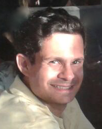
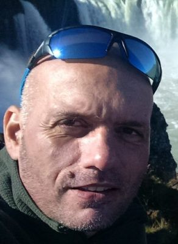
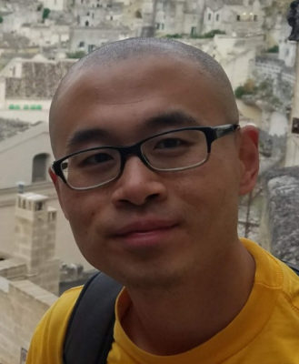
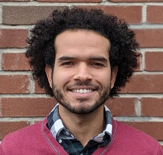
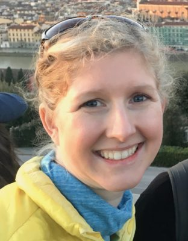

## Contact

**Spatial Ecology** is a private company (limited by guarantee) and incorporated as non-profit organisation under United Kingdom company no. 09589642.

Spatial Ecology  
Dickinsons, Brandon House, First Floor, 90 The Broadway,  
Chesham, England, HP5 1EG  
United Kingdom  

## Team

---

**Tushar Sethi**, MSc, DIC  
Director, Spatial Ecology  
Managing Director, Margosa Environmental Solutions Ltd.  
[Publications](https://scholar.google.com/citations?hl=en&user=8PDAFyYAAAAJ&view_op=list_works&gmla=AJsN-F68v2QhT8sCEzttbMMJeIvnWWeWYewhRQYc1qT6_O76Ffly6g6XTdauo6HLp4GV4lUCXzZvkb6qsbDKXtXCcSIuGpdR5y6UpbBcezg7E5RThjI_sws)  

Tushar is the head of operations at Spatial-Ecology. He has an environmental engineering and management background, and is responsible for the company’s strategic agenda, communications and development.

Tushar has extensive experience as an environmental consultant in the waste and water management sectors. He focuses on geoinformatics solutions for environmental applications, and through the course of his environmental career, has specialised in water management, waste treatment and materials recovery, and energy from waste and other renewable sources. He has provided techno-economic analyses of environmental and alternative energy infrastructure projects and expert insights for clients including investment managers, and government and private sector institutions across Asia, Europe and the US.

Tushar is also a Director of Margosa Environmental Solutions Ltd, a UK-based geoinformatics firm that delivers natural resource data, analytics, and mapping solutions. Prior to environmental services, Tushar worked for several years in the finance industry in liability risk management and capital markets. His client portfolio included energy and infrastructure companies, government agencies and financial institutions in Europe.

Tushar holds an MSc, DIC in Environmental Technology from Imperial College London. In addition, he has an MSc from the London School of Economics and a BA from Emory University. His favourite pastimes are tennis, photography and fishing.

---

**Giuseppe Amatulli**, PhD  
Geo-data Scientist  
Scientific & Technical Director, Spatial Ecology  
[Publications](https://scholar.google.com/citations?hl=en&user=LSxTtpMAAAAJ&view_op=list_works&sortby=pubdate)  
  
Giuseppe is the lead scientist at Spatial-Ecology for data analysis and product development. He is an accredited GIS data expert with deep expertise in spatial modelling and coding with open source software for environmental applications. His current focus is on hydrological modelling at a global scale, in addition to researching species distribution under climate change scenarios.

Giuseppe has a breadth of experience in GIS technologies, remote sensing, informatics, cluster and parallel computing, and statistics. He is proficient in applying complex modelling techniques to automate the analysis of high-resolution data under Linux-based platforms.

Giuseppe holds a research scientist position at Yale University in the US, and has previously worked at the European Commission Joint Research Centre, and the University of Zaragoza. His coverage of the forestry and environmental sectors entails wildfire occurrence risk and pattern recognition, ecological shifts under climate geo-engineering scenarios. Notably, he runs geocomputation training courses worldwide on the latest data programming techniques.

Giuseppe has a PhD from the University of Basilicata in Italy, an MSc in Geo-Information Science from Wageningen University, and MSc in Forestry from Bari University. His time away from coding is spent leading adventure trips in remote locations, which involve canyoning, caving, rafting and hiking.

---

**Longzhu Shen,** PhD
Scientific Advisor, Spatial Ecology  
[Publications](https://scholar.google.com/citations?hl=en&user=sAyCqOYAAAAJ&view_op=list_works&sortby=pubdate)

Longzhu is a mathematical modeller with a specialisation in quantum mechanics and statistical learning algorithms. At Spatial Ecology, he is leading the development of water chemistry analytics by integrating water quality assessment into a global hydrological model using machine learning techniques.

Longzhu’s breadth of experience ranges from spatial modelling for charting nutrient distribution in freshwater to the development of algorithms to engineer chemicals with a lower toxicity potential. He is proficient in electronic structure calculations, chemical reaction mechanism investigations, and multiscale modeling for complex biological systems.

Longzhu also holds a research scientist position at Cambridge University in the UK, where he is developing mathematical models to predict the molecular evolution of prominent viruses, which can be used to advance vaccine design.

Longzhu has a PhD in Chemistry from Carnegie Mellon University, and did his post-doctoral research in toxicology and molecular design at Yale University. In his spare time, he enjoys hiking, skateboarding and travelling.

---

**Antonio Fonseca,** PhD  
Machine Learning trainer,  
Spatial Ecology;  
[Publications](https://scholar.google.com/citations?user=G2irlNcAAAAJ&hl=en)  

Antonio is a machine learning researcher working at the intersection between Computational Neuroscience and Deep Learning. He is currently interested in using Deep Learning to model brain dynamics and what it can tell us about cognition and behavior.

Antonio’s expertise includes robotics (software and hardware development), signal processing, computational vision, behavioral neuroscience and deep learning algorithms. More specifically, he is an expert in applying and developing machine learning frameworks to complex problems.

Antonio worked on software development for mining robots and solutions for banking companies. Most recently, he worked on applying machine learning and signal processing techniques to investigate behavior in developing animals, which has important implications for studies involving genetic disorders and how to treat them.

Antonio is a Neuroscience Ph.D student at Yale University, obtained a bachelor’s degree in robotics engineering and a master’s in microelectronics. When he is not thinking about biological or artificial neuronal networks, Antonio enjoys rock climbing and hiking (most often doing both on the same trip).

---

**Alexandria Smith**, MSPH  
Big data management and analytics  
  
Alexandria is a research programmer, as well as a clinician. She has experience in applied research using large health records to answer pressing public health questions. At Spatial Ecology she advises on big data management, statistical analysis and public health applications.

Alexandria is skilled in the use of statistical and data management software such as R and SQL, and in manipulation techniques for complex health and demographic data. She previously worked at the Rand Corporation as a research programmer, where she conducted quantitative analysis on numerous health policy studies. She is currently working in clinical practice as an Advanced Practice Registered Nurse in the US, and is also a researcher analysing Electronic Health Records in the Veterans Affairs Healthcare System.

Alexandria holds an MSPH in Health Policy Research from Emory University, and an MSN from Yale University where she is also pursuing a PhD in public health and nursing. She is an avid road biker, and enjoys hiking and taking piano lessons in her spare time.

---
**Fjona Skarpa**,   

The photos on this site were captured by Fjona Shkarpa. These shots come from my passion for nature and mountain trails. I photograph for pure pleasure, trying to carry with me a small piece of those landscapes and those colors that light up at the end of the day. These shots are my spontaneous contribution to this site.

---

### Collaborators

**Dr. [Francesco P. Lovergine](http://www.issia.cnr.it/wp/?portfolio=francesco-lovergine)**; CNR - [ISSIA](http://www.issia.cnr.it/wp/) Institute of Intelligent Systems for Automation, Bari Italy; Founder of [DebianGis](https://wiki.debian.org/DebianGis) project

**Dr. [Daniel McInerney](http://earthzine.org/about/daniel-mcinerney-forestry-editor/)**, Ph.D.; Coillte Teoranta – The Irish State Forestry Board; [Publications](https://www.researchgate.net/profile/Daniel_McInerney)

**Dr. Sami Domisch**; Postdoctoral fellow at Leibniz-Institute of Freshwater Ecology and Inland Fisheries, Department of Ecosystem Research, Berlin, Germany; [Publications](https://scholar.google.com/citations?user=Fd-zyZkAAAAJ&hl=en)

**Dr. Pieter Kempeneers**; Scientist at the Joint Research Centre of the European Commission; [Publications](https://scholar.google.com/citations?user=1m4Ytt0AAAAJ&hl=en&oi=sra)

**Dr. Cristiano Giovando**; [TerraPan Labs](http://www.terrapanlabs.com/); [Open Aerial Map](https://hotosm.org/users/cristiano_giovando) - Humanitarian OpenStreetMap.

**Dr. [Salvatore Manfreda](http://www2.unibas.it/manfreda)**; Associate Professor of Water Management and Ecohydrology. Università degli Studi della Basilicata, Italy; Director of HydroLab

**Raffaele Albano, PhD**; Università degli Studi della Basilicata, Italy; [Publications](https://www.researchgate.net/profile/Raffaele_Albano)

**Prof. [Peter Bauman](http://www.faculty.jacobs-university.de/pbaumann/iu-bremen.de_pbaumann/)**; Professor of Computer Science, Director of the L-SIS group at Jacobs University Bremen, Germany; Founder and CEO of [rasdaman](http://www.rasdaman.com/)

**Dr. [Andrew Cowley](http://www.exeter.ac.uk/esi/people/researchandtechnical/cowley/)**; Computing Development Officer at the Environment and Sustainability Institute, University of Exeter, Cornwall, UK

[**Darren J. Doherty**](http://www.regrarians.org/about/darren-j-doherty-cv/); Originator of the [Regrarians Platform](http://www.regrarians.org/about/the-regrarian-platform/ "The Regrarian Platform")**,** Victoria, Australia. 

**[Alex Dumitru](http://kahlua.eecs.jacobs-university.de/~lsis/index.php)**; PhD candidate at L-SIS group (Large-Scale Scientific Information Systems Research Group), Jacobs University Bremen, Germany

**[Oliver Hatfield](http://www.makernow.co.uk/users/oliver-hatfield)**; 3D design maker; Founder of [oh-design](http://oh-design.co.uk/) specialising in exhibition, retail and product design

**Dr. [Marcin Jakubowski](http://opensourceecology.org/marcin-jakubowski/)**; Fusion physicist; Founder and Executive Director of [Open Source Ecology](http://opensourceecology.org/)

**Dr. [Marta A. Jarzyna](http://jetzlab.yale.edu/people/marta-jarzyna)**; Postdoctoral researcher at Yale Jetz Lab: Global Biodiversity, Ecology & Conservation; [Publications](https://scholar.google.com/citations?user=ZG8QBsIAAAAJ&hl=en)

**[Vlad Merticariu](http://kahlua.eecs.jacobs-university.de/~lsis/index.php)**; PhD candidate at L-SIS group (Large-Scale Scientific Information Systems Research Group), Jacobs University Bremen, Germany

**Dr. [Alba N. Mininni](http://spatial-ecology.net/dokuwiki/doku.php?id=wiki:personalpages:albamininni)**; DiCEM - Univ. degli Studi della Basilicata, Italy; [Publications](https://www.researchgate.net/profile/Alba_Mininni)

**[Andy Smith](http://www.makernow.co.uk/users/andy-smith)**; Technologist and web developer at [Centre for Smart Design;](https://www.falmouth.ac.uk/centre-for-smart-design) co-founder of video production company [Joint Effort Studios](https://www.falmouth.ac.uk/centre-for-smart-design); [Linkedin](https://www.linkedin.com/in/andy-smith-a1691552)

**Dr. [Adam M. Wilson](http://adamwilson.us/)**; Director of Wilson Lab; Assistant professor of global environmental change in the Geography Dept. at the Univ. of Buffalo; [Publications](https://scholar.google.com/citations?user=zgVlijsAAAAJ&hl=en)

**Dr. Annemarie Bastrup-Birk**; [European Environment Agency](http://www.eea.europa.eu/) - Forests & Environment; [Publications](https://scholar.google.com/citations?user=sPDuGI0AAAAJ)
