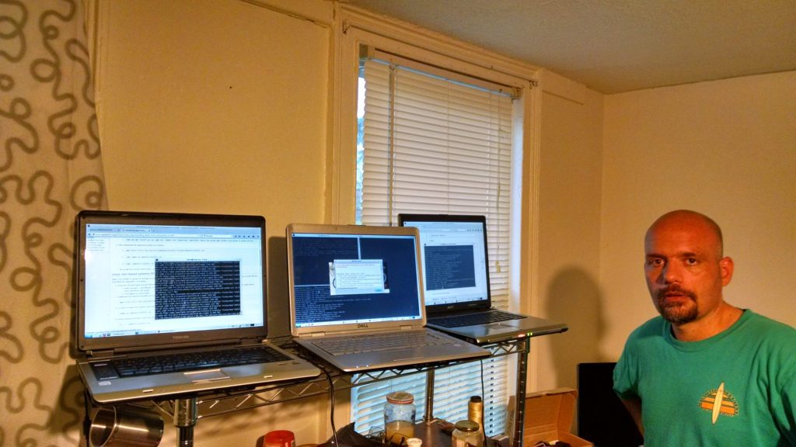
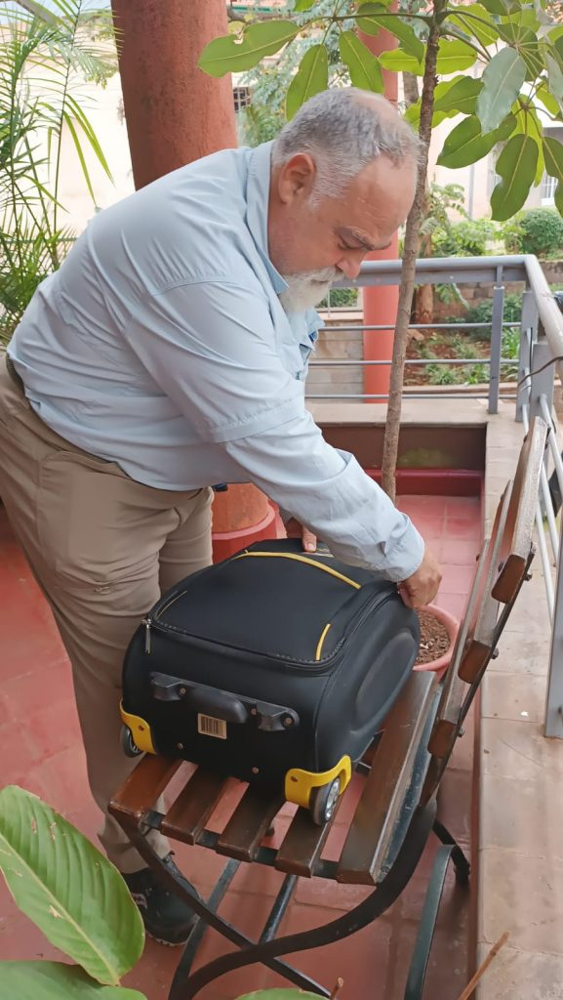
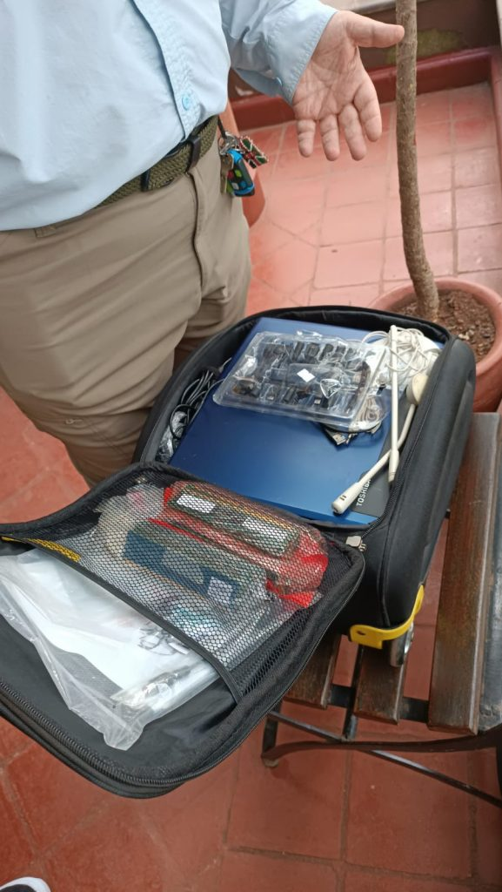
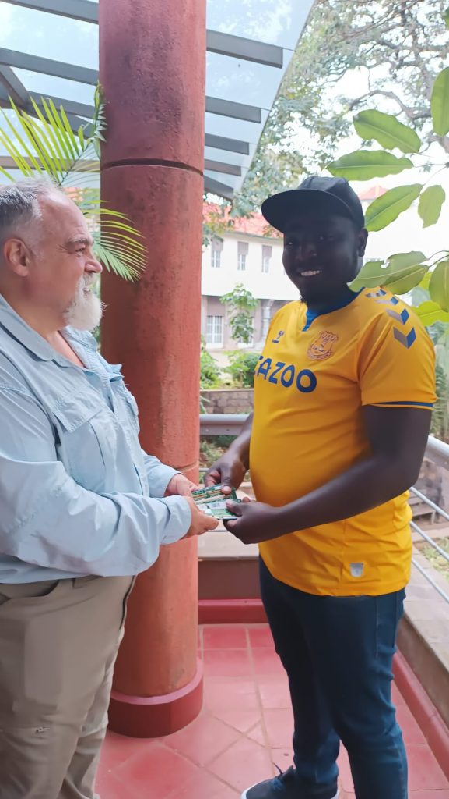
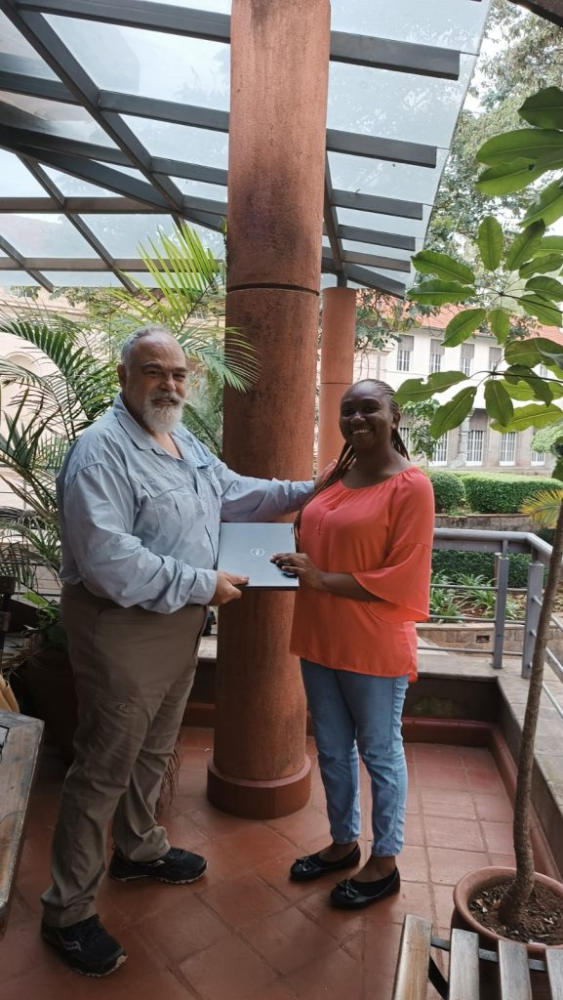

The RAM4Africa project aims to narrow the digital technology gap in Africa by collecting disused computing hardware (mainly laptops and mobiles) from the EU and USA, installing Ubuntu and redistributing the revamped devices to communities in Africa. 

**Contact points**

[Giuseppe Amatulli](https://spatial-ecology.net/pages/about_us/about_us) (Italy) _g.amatulli@spatial-ecology.net_

[Diana Kemunto](https://www.linkedin.com/in/diana-kemunto-0a2118189/?originalSubdomain=ke) (Kenya): _diana.kemunto44@gmail.com_, WhatsApp +254717525823

[Ferdinando Didonna](https://www.linkedin.com/in/ferdinandodidonna/?originalSubdomain=cr) (Kenya): _ferdinando.didonna@gmail.com_

[Taiwo Adekunle Adenike](https://www.linkedin.com/in/adekunle-taiwo-adenike-953a63b9/) (Nigeria): _adekunlebasirat@gmail.com_, WhatsApp +234 903 939 0354

If you would like to support RAM4Africa by collecting devices and becoming a program ambassador, please get in touch with Giuseppe at _g.amatulli@spatial-ecology.net_.

## The technology gap
  
Technology advancements are shaping our world in many amazing ways.  The recent release of ChatGPT is one of many fascinating examples of evolutionary leaps in computing. The African tech space is burgeoning along with the rest of the world, and for its programmers to thrive in this competitive era, having access to technological hardware and the internet, as well as the knowledge to use these resources is absolutely vital.

While there are certainly challenges to overcome, such as the digital divide and limited access to affordable and reliable internet connectivity, there are also many initiatives aimed at creating a universal opportunity for participation in this latest revolution. By acquiring essential computing skills, people in Africa can harness the power of new technologies, broaden their horizons and unlock new opportunities.

The population of Africa is about 1.4 billion but only around 22-25% of people on the continent have access to the internet. A lack of access to telephones and computing hardware is a principal reason for such poor connectivity. It highlights the need to address Africa's digital divide and ensure universal access to tools of the digital age. What can we do to help the remaining 75%?

## The RAM4Africa project

RAM4Africa is a new not-for-profit project dedicated to bringing affordable and reliable technology to communities throughout Africa. Access to technology is a critical factor in creating economic opportunities, improving education, and promoting social and cultural growth. The project's mission is to empower disadvantaged individuals who have drive and ambition but lack the means to procure the tools needed to navigate and thrive in a digital world.

RAM4Africa plans to create a network of partners, suppliers, and distributors throughout the continent to collect, refurbish, and distribute high-quality computers, laptops, and other technology products at affordable prices. We will work closely with local communities to identify their specific needs and endeavour to provide the optimal technology solutions.

The refurbishing process will ensure that the technology we offer is reliable, secure, and up-to-date, so that individuals, schools and other beneficiaries can make the most of their devices. We will also provide training, support, and other resources to help our customers navigate the digital landscape.

Ram4Africa intends for  access to affordable and reliable technology to be within reach for everyone, no matter where they live. Join us in our mission to bridge the digital divide and create a brighter future for Africa through technology.

## Digital technology requirements

We are seeking digital and technology devices with following features:

**LAPTOPS**:  With or without battery but with at least 2 GB RAM. Most importantly, these machines should boot without any issues. If the charger is missing, no problem!

**MOBILES:** These also need to be able to boot. The smart-phone types are better but even the old Nokia 3310 or Nokia 3410 are welcome. The latter are often preferred because of their long battery life. Again, a missing charger isn't a problem.

**OTHER DEVICES:** other devices are welcome such as photo-cameras, tablets, etc. The most important requirement for these too is that they work properly.

## How to bring affordable technology to Africa: a crowdsourcing model based on a responsible tourism initiative

We propose an innovative project model that involves the collaboration of citizens in developed countries and communities in developing countries to support and empower each other. In this model a single tourist can play a central role in collecting the device and transporting them to the final destination. We can summarise the full process in four main steps.    

**STEP 1: Collection**

The first step of the model involves collecting and functionality checking of old laptops, phones, and electronic gadgets from people who no longer need them in developed countries outside Africa. This is undertaken by a tourist travelling to Africa.

**STEP 2: Transportation**

We rely on tourists and travel groups visiting African countries, currently focusing on Kenya, to help us transport the devices to our points of contact. We canarrange to meet the tourists at the airport or other agreed-upon locations to receive the donated devices.

**STEP 3: Linux OS installation**

Our IT personnel in Kenya service the machines by installing Ubuntu OS and customising the software to suit the needs of end-users**.**

**STEP 4: Distribution** 

Finally, we offer the refurbished devices back to the community at a subsidised price and donate a significant portion of the proceeds of sales to support that community.

## Donated device database

For complete accountability and transparency, the devices that we receive and donate are documented on this google doc: [RAM4Africa Devices Database](https://docs.google.com/spreadsheets/u/1/d/1PPZ-l-XmyLS3ZE51HcewTT3xn68CkxJ_wYLnd5CEYuY/pub)

## Photo documentation of the donated devices

[Kenya album](https://photos.app.goo.gl/onREiczfmVenpGgXA)

[Nigeria album](https://photos.app.goo.gl/BDLi2mup5kUj47kUA)

Linux installation in refurbished pc

 

First device delivery in Kenya!!!  Ferdinando is handling the donated devices to Nelson and Diana!!

